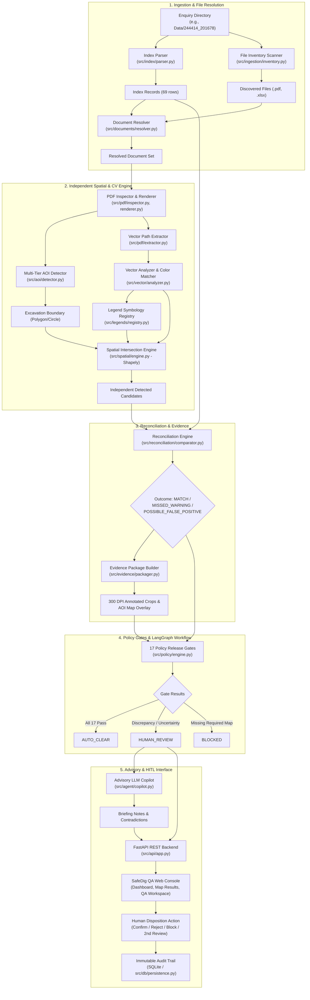
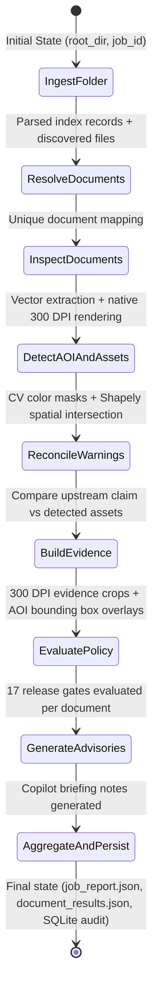

# SafeDig — AI Map QA & Validation Platform
## Comprehensive Technical Documentation & Architecture Specification

---

## 1. Project Overview & Business Domain

### 1.1 The Core Problem
In the UK and global utility infrastructure sector (similar to **LinesearchbeforeUdig** / **BeforeYouDig**), contractors and excavation teams request underground asset searches before digging. Utility providers (Gas, Electricity, Water, Telecoms) issue safety plans (PDF maps) displaying underground cables, mains, and high-pressure pipes.

An upstream automated system or extraction pipeline reads these enquiry responses and compiles a summary report. However, safety-critical errors frequently occur:
1. **Missed Warnings (False Negatives)**: High-pressure gas mains or 33kV/132kV high-voltage cables exist directly inside the excavation site boundary (the **Area of Interest / AOI**), but the upstream system missed them. An excavator striking these can cause explosions, electrocution, and fatalities.
2. **False Alarms (False Positives)**: High-pressure gas or trunk mains pass *outside* the enquiry boundary, yet the upstream system flagged a critical hazard. This halts construction unnecessarily and wastes millions.
3. **Missing Critical Utility Maps**: An enquiry index lists a utility as "Affects" (assets present), but the actual map PDF is missing or corrupted.

### 1.2 The SafeDig Solution
**SafeDig** is an enterprise-grade, deterministic **AI Map QA & Validation Platform**. It acts as an independent, secondary supervisory validator that inspects every utility plan before release:
- **Zero Escaped Hazards**: If a hazard is within the enquiry boundary, it is identified with zero tolerance for false negatives.
- **Strict AOI Filtering**: Assets outside the dashed magenta/purple enquiry circle are excluded from false alarms.
- **17 Deterministic Release Gates**: Hard mathematical, spatial, and vector checks that must pass for automatic clearance (`AUTO_CLEAR`).
- **Human-in-the-Loop (HITL) Queue**: Any discrepancy between upstream claims and independent findings routes to human QA experts (`HUMAN_REVIEW`).
- **Immutable Audit Trail**: Every document resolution, policy evaluation, and human decision is cryptographically tracked in an immutable SQLite audit log.
- **LLM as Advisory Copilot Only**: Language models are strictly confined to generating explanatory briefing notes and detecting narrative contradictions. They have **zero decision authority** over release gates.

---

## 2. System Architecture

### 2.1 High-Level Architecture Diagram



### 2.2 LangGraph Orchestration State Machine

The entire pipeline executes as a deterministic, typed state machine using **LangGraph** ([`src/orchestration/workflow.py`](file:///d:/Safedig_AG/src/orchestration/workflow.py)):



---

## 3. Directory Structure & Code Organization

```
d:/Safedig_AG/
├── Data/                              # Real multi-utility project enquiry folders
│   ├── 244414_201678/                 # 69 enquiry records, Wales & West, SGN, UKPN, etc.
│   ├── warnings_list 2 1 (1).xlsx    # Master authoritative warning definitions
│   └── ...                            # 12 other full enquiry directories
├── qa_output/                         # Job artifacts, evidence packages, crops, reports
├── src/
│   ├── agent/                         # Advisory Copilot (LLM briefing, rule assistant fallback)
│   ├── aoi/                           # Multi-tier AOI enquiry boundary detector
│   ├── api/                           # FastAPI application, REST endpoints, static frontend
│   │   ├── routes/                    # jobs.py, qa.py, evidence.py, eval.py, health.py
│   │   └── static/                    # index.html, app.js, styles.css
│   ├── audit/                         # Decision records, hashing, immutability verification
│   ├── batch/                         # Multi-folder batch scanner, worker queue, supervisor
│   ├── config/                        # Pydantic v2 settings, logging formatters
│   ├── cv/                            # OpenCV color masking, HSV wrap-around, contour analysis
│   ├── db/                            # SQLAlchemy models, SQLite persistence, audit trail
│   ├── detection/                     # Independent vector scanning engine
│   ├── documents/                     # Document resolution & matching against index records
│   ├── domain/                        # Domain models (AOI, Document, Warning, Legend, Gates)
│   ├── eval/                          # Benchmark datasets, accuracy metrics, regression harness
│   ├── evidence/                      # 300 DPI evidence crops, AOI overlays, packaging
│   ├── index/                         # Production Excel index.xlsx read-only parser
│   ├── ingestion/                     # Root directory file scanner & discovery
│   ├── legends/                       # Symbology registry (Gas, Electricity, Water, Telecoms)
│   ├── orchestration/                 # LangGraph state machine & workflow execution
│   ├── pdf/                           # PyMuPDF extractor, 300 DPI renderer, inspector
│   ├── policy/                        # 17 mandatory release gates
│   ├── qa/                            # Human review workspace builder, disposition actions
│   ├── reconciliation/                # Upstream vs independent finding comparator
│   ├── spatial/                       # Shapely geometry transformations, coordinate scaling
│   ├── vector/                        # Stroke color matching, Bezier curves, style filtering
│   └── warnings/                      # Master 44-warning catalogue loader & search
└── tests/                             # 75 unit & integration tests (100% pass rate)
    ├── unit/                          # 29 unit test modules
    └── integration/                   # 8 end-to-end integration test suites
```

---

## 4. In-Depth Section-by-Section Code Walkthrough

### 4.1 Configuration & Domain Layer (`src/config/`, `src/domain/`)

#### [`src/config/settings.py`](file:///d:/Safedig_AG/src/config/settings.py)
- Uses `pydantic_settings.BaseSettings` with environment variable overrides.
- Manages paths (`output_dir = "qa_output"`), engine version strings (`engine_version = "1.0.0"`), database URLs (`sqlite+aiosqlite:///safedig.db`), and LLM API keys.

#### [`src/domain/enums.py`](file:///d:/Safedig_AG/src/domain/enums.py)
Defines all type-safe system states:
- `Decision`: `AUTO_CLEAR`, `HUMAN_REVIEW`, `BLOCKED`.
- `ReconciliationOutcome`: `MATCH`, `MISSED_WARNING`, `POSSIBLE_FALSE_POSITIVE`, `TYPE_MISMATCH`, `LOCATION_MISMATCH`, `DUPLICATE`, `CONFIRMED_CLEAN`, `UNCERTAIN`.
- `DetectionMethod`: `VECTOR_ANALYSIS`, `CLASSICAL_CV`, `OCR_EXTRACTION`, `TEXT_LABEL`, `HYBRID_FUSION`.
- `AOIDetectionMethod`: `NATIVE_VECTOR`, `EXPLICIT_GEOMETRY`, `EXTERNAL_SOURCE`, `CV_CONTOUR`, `FALLBACK`.
- `Severity`: `CRITICAL`, `HIGH`, `MEDIUM`, `LOW`.

#### Core Domain Entities (`src/domain/`)
- [`aoi.py`](file:///d:/Safedig_AG/src/domain/aoi.py): `AOI` object carrying `bbox` `[x0, y0, x1, y1]`, `coordinates` polygon, `confidence` score (0.0-1.0), and `tolerance_pt` buffer (default 5.0 points).
- [`warning.py`](file:///d:/Safedig_AG/src/domain/warning.py): `WarningDefinition` (from Excel catalogue) and `ClaimedWarning` (upstream input).
- [`legend.py`](file:///d:/Safedig_AG/src/domain/legend.py): `LegendProfile`, `FeatureSymbology`, `ColorDefinition`, `StrokeDefinition`.
- [`policy.py`](file:///d:/Safedig_AG/src/domain/policy.py): `GateEvaluation` and `PolicyResult`.

---

### 4.2 Ingestion & Document Resolution (`src/ingestion/`, `src/index/`, `src/documents/`)

#### [`src/index/parser.py`](file:///d:/Safedig_AG/src/index/parser.py)
- Reads `index.xlsx` in **read-only mode** using `openpyxl`. The file is strictly immutable.
- Normalizes column names (Provider, Utility, Status, Warning, Comments).
- Maps raw statuses: `"Affects"` &rarr; `is_asset_present=True`; `"Pass"` / `"No"` / `"Clear"` &rarr; `is_asset_present=False`.

#### [`src/ingestion/inventory.py`](file:///d:/Safedig_AG/src/ingestion/inventory.py)
- Scans the directory recursively using `os.walk`.
- Computes SHA-256 checksums, extracts MIME types, and classifies files (`MAP`, `INDEX`, `LEGEND`, `SAFETY_REFERENCE`, `OTHER`).

#### [`src/documents/resolver.py`](file:///d:/Safedig_AG/src/documents/resolver.py)
- Resolves index records to physical map files using a multi-strategy heuristic:
  1. Exact filename match.
  2. Provider code token matching (e.g., `"WWU"` &rarr; Wales & West Utilities, `"SGN"` &rarr; SGN Gas).
  3. Utility type affinity matching.
- Flags missing files for `"Affects"` records as `DocumentResolutionStatus.MISSING`, directly triggering `BLOCKED`.

---

### 4.3 PDF Inspection & Multi-Tier AOI Detection (`src/pdf/`, `src/aoi/`)

#### [`src/pdf/renderer.py`](file:///d:/Safedig_AG/src/pdf/renderer.py)
- Renders PDF pages to **300 DPI native PNGs** via `pymupdf` (`Matrix(zoom, zoom)` where `zoom = dpi / 72.0`).
- Enforces `colorspace=pymupdf.csRGB` and `alpha=False` to prevent color degradation or BGR inversion in OpenCV.

#### [`src/pdf/extractor.py`](file:///d:/Safedig_AG/src/pdf/extractor.py)
- `extract_page_vector_paths()`: Pulls all PDF vector drawings with color, width, dashes, and path items (`l` = line, `re` = rect, `c` = curve, `qu` = quad).
- `extract_text_blocks_in_aoi()`: Uses PyMuPDF's spatial clip API `page.get_text("text", clip=aoi_rect)` to extract text labels specifically located inside the site boundary.

#### [`src/aoi/detector.py`](file:///d:/Safedig_AG/src/aoi/detector.py)
The critical boundary detector uses a **3-tier priority scan**:
1. **Tier 1: Magenta / Purple Dashed Boundary (Confidence 0.99)**
   - The universal UK utility enquiry boundary color (RGB ~255, 0, 255 / HSV ~300°).
   - Dashes matching patterns such as `[12, 6]` or `[6, 6]`.
   - Filters out small legend icons and margin logos by checking canvas coordinates: ignores page headers (`y1 < 4%`) and footers (`y0 > 88%`).
2. **Tier 2: Red Dashed Enquiry Boundary (Confidence 0.95)**
   - Used by certain electricity and water providers.
3. **Tier 3: Vector Drawing Rect Canvas / Central Fallback (Confidence 0.90 / 0.70)**
   - Fallback when no explicit dashed line exists.

---

### 4.4 Spatial Analysis & Vector Processing (`src/vector/`, `src/cv/`, `src/spatial/`)

#### [`src/vector/analyzer.py`](file:///d:/Safedig_AG/src/vector/analyzer.py)
- `normalize_color_to_rgb()`: Normalizes PyMuPDF color formats (0-1 floats, greyscale floats, CMYK 4-tuples) to standard `(R, G, B)` integers (0-255).
- `color_distance()`: Employs **ITU-R BT.709 perceptual-weighted distance** ($0.2126 \cdot \Delta R + 0.7152 \cdot \Delta G + 0.0722 \cdot \Delta B$) matching human eye sensitivity.
- `filter_drawings_by_style()`: Filters drawing elements by color, line width, and has `exclude_dashed=True` to ensure dashed AOI boundaries are never confused with utility pipelines.

#### [`src/vector/geometry.py`](file:///d:/Safedig_AG/src/vector/geometry.py)
- Converts PyMuPDF path primitives into **Shapely** geometry (`LineString`, `MultiLineString`, `Polygon`).
- **Bezier Approximation**: Samples Bezier curves using **De Casteljau's algorithm** at $t \in [0, 0.25, 0.5, 0.75, 1.0]$ rather than straight chords, maintaining precision on curved underground pipes.

#### [`src/cv/color.py`](file:///d:/Safedig_AG/src/cv/color.py)
- Implements classical computer vision color masking in HSV space.
- **Red Hue Wrap-Around Fix**: In OpenCV, Hue ranges from 0 to 179. Pure red straddles 0 and 179. The algorithm splits red into two bands ($[0, H+\text{tol}]$ and $[180-\text{tol}, 179]$) and applies `bitwise_or` so red gas and water trunk mains are never lost.

#### [`src/spatial/engine.py`](file:///d:/Safedig_AG/src/spatial/engine.py)
- Converts `AOI` to Shapely `Polygon` or `box`.
- Buffers the boundary by `tolerance_pt` (default 5.0 points).
- Computes `aoi_poly.intersects(geometry)` and `aoi_poly.distance(geometry)`.
- **The Core Rule**: If a utility line is outside the buffered AOI, it is rejected from the hazard candidate list, preventing outside-AOI false alarms.

---

### 4.5 Legend Symbology & Warning Catalogue (`src/legends/`, `src/warnings/`)

#### [`src/legends/registry.py`](file:///d:/Safedig_AG/src/legends/registry.py)
Contains multi-utility symbology profiles:
- **SGN Gas**: HP Gas (Red/Orange, stroke width 2.0-5.0 pt), MP Gas (Green, 1.5-3.0 pt), LP Gas (Yellow/Blue, 0.8-2.0 pt).
- **Wales & West Utilities (WWU)**: HP Gas (Red/Orange, 2.0-6.0 pt).
- **UK Power Networks (UKPN)**: High Voltage (Red/Purple, 1.0-4.0 pt), Low Voltage (Green/Cyan, 0.6-2.0 pt).
- **Cadent Gas**: High Pressure (Red, 2.0-5.0 pt), Intermediate Pressure (Blue, 1.5-3.0 pt).
- **Water Networks (Thames Water, etc.)**: Potable Trunk Main (Red solid line, RGB 255,0,0, text "TRUNK"), Distribution Mains (Cyan/Blue, RGB 0,180,255, labels "100MM", "150MM").

#### [`src/warnings/catalogue.py`](file:///d:/Safedig_AG/src/warnings/catalogue.py)
- Loads 44 authoritative business warning definitions from `warnings_list 2 1 (1).xlsx`.
- Normalizes search queries, severity assignments (`CRITICAL`, `HIGH`, `MEDIUM`, `LOW`), and utility classifications.

---

### 4.6 Detection, Reconciliation & Evidence Packaging (`src/detection/`, `src/reconciliation/`, `src/evidence/`)

#### [`src/detection/engine.py`](file:///d:/Safedig_AG/src/detection/engine.py)
Executes independent QA scans:
1. Iterates through all legend features for the provider.
2. Filters vector drawings matching line style, excluding dashed enquiry lines.
3. Performs spatial intersection testing against the AOI.
4. Cross-checks text labels inside the AOI (boosting confidence to 0.99 if confirmed).
5. Emits typed `DetectedCandidate` instances.

#### [`src/reconciliation/comparator.py`](file:///d:/Safedig_AG/src/reconciliation/comparator.py)
Compares upstream claims with independent findings:
- Both agree hazard is present &rarr; `MATCH`.
- Neither detected hazards &rarr; `CONFIRMED_CLEAN`.
- Upstream claimed clean, but independent scan found hazard inside AOI &rarr; **`MISSED_WARNING`** (Critical failure &rarr; `HUMAN_REVIEW`).
- Upstream claimed hazard, but independent scan found no intersecting asset inside AOI &rarr; **`POSSIBLE_FALSE_POSITIVE`** (Potential false alarm &rarr; `HUMAN_REVIEW`).

#### [`src/evidence/packager.py`](file:///d:/Safedig_AG/src/evidence/packager.py) and [`src/evidence/crops.py`](file:///d:/Safedig_AG/src/evidence/crops.py)
- Generates 300 DPI high-resolution visual evidence crops centered on detected assets with a 50px contextual margin.
- Generates full page map renders with dual-layer bounding box overlays and an **`AOI SITE BOUNDARY`** red tag badge.
- Assembles audit-ready `EvidencePackage` objects saved into `qa_output/{job_id}/evidence/`.

---

### 4.7 The 17 Deterministic Release Gates (`src/policy/engine.py`)

Every document must pass all 17 gates to qualify for `AUTO_CLEAR`:

| Gate ID | Name | Failure Trigger Condition | Action on Failure |
|:---|:---|:---|:---|
| **GATE-01** | `INDEX_RECORD_INTEGRITY` | Incomplete or corrupt row in `index.xlsx` | `BLOCKED` |
| **GATE-02** | `FILE_DISCOVERY` | File referenced in index does not exist on disk | `BLOCKED` |
| **GATE-03** | `DOCUMENT_RESOLUTION` | Ambiguous or unresolvable document association | `BLOCKED` |
| **GATE-04** | `PDF_INTEGRITY` | Corrupted PDF, 0 pages, or unreadable file | `BLOCKED` |
| **GATE-05** | `PDF_MODALITY` | Unreadable raster/scanned image without vector paths | `HUMAN_REVIEW` |
| **GATE-06** | `PAGE_COUNT_VERIFICATION` | Document page count mismatch with metadata | `BLOCKED` |
| **GATE-07** | `AOI_DETECTION_SUCCESS` | Failed to detect enquiry site boundary | `HUMAN_REVIEW` |
| **GATE-08** | `AOI_CONFIDENCE_THRESHOLD` | AOI detection confidence score < 0.75 | `HUMAN_REVIEW` |
| **GATE-09** | `LEGEND_RESOLUTION` | Provider symbology not found in legend registry | `HUMAN_REVIEW` |
| **GATE-10** | `INDEPENDENT_DETECTION` | Vector scan failed to complete | `BLOCKED` |
| **GATE-11** | `RECONCILIATION_CONSISTENCY` | Upstream claim contradicts independent findings | `HUMAN_REVIEW` |
| **GATE-12** | `MISSED_HAZARD_DISCOVERY` | Independent scan detected hazard upstream missed | `HUMAN_REVIEW` |
| **GATE-13** | `FALSE_POSITIVE_AUDIT` | Upstream flagged hazard not present inside AOI | `HUMAN_REVIEW` |
| **GATE-14** | `EVIDENCE_COMPLETENESS` | Missing evidence crop or render for detection | `HUMAN_REVIEW` |
| **GATE-15** | `CRITICAL_SEVERITY_GATE` | High-pressure gas or high-voltage line detected | `HUMAN_REVIEW` |
| **GATE-16** | `AUDIT_TRAIL_INTEGRITY` | Missing cryptographic hash or decision signature | `BLOCKED` |
| **GATE-17** | `POLICY_FINAL_SAFETY_RULE` | Global catch-all invariant check | `BLOCKED` |

---

### 4.8 Human-in-the-Loop QA & Web Console (`src/qa/`, `src/api/`)

#### [`src/qa/human_disposition_service.py`](file:///d:/Safedig_AG/src/qa/human_disposition_service.py)
Allows certified reviewers to act on flagged items:
- `CONFIRM_WARNING`: Verifies that the detected hazard is genuine.
- `REJECT_WARNING`: Rejects upstream false alarms with required reviewer justification comments.
- `BLOCK`: Blocks job delivery.
- `REQUEST_SECOND_REVIEW`: Escalates complex edge cases to a supervisor.

#### Web Interface (`src/api/static/`)
- **Dashboard**: Live metrics (Total processed, Auto-Clear rate, Review rate, Blocked rate), directory-level job overview, preset selection, and pipeline trigger button.
- **Individual Map Results View**: Mandatory drill-down displaying every map/document across 13 columns with filtering by decision, live text search, multi-field sorting, and direct "Inspect" action.
- **QA Queue**: Worklist of all items awaiting human disposition.
- **Map QA Workspace**: Split-screen interface with 300 DPI evidence viewer, AOI coordinate metadata, reconciliation findings, AI advisory notes, interactive 17 Policy Gates breakdown, and disposition action controls.

---

## 5. System Execution & Debugging Guide

### 5.1 Prerequisites & Environment Setup
- **Python**: 3.11+
- **Working Directory**: `d:\Safedig_AG\`
- **Virtual Environment**: Use current system Python (`C:\Users\Admin\AppData\Local\Programs\Python\Python311\python.exe`).

### 5.2 Starting the Server
Run the FastAPI production server with hot reload:
```powershell
python -m uvicorn src.api.app:create_app --factory --host 0.0.0.0 --port 8000 --reload
```
Access the console at: **`http://localhost:8000/`**

### 5.3 Running Tests
Run the entire automated test suite (75 tests):
```powershell
python -m pytest tests/ -v
```

Run specific test modules:
```powershell
# Unit test for AOI detector
python -m pytest tests/unit/test_aoi_service.py -v

# Unit test for CV engine
python -m pytest tests/unit/test_cv_engine.py -v

# Integration test for map-level QA visibility
python -m pytest tests/integration/test_map_level_qa.py -v

# End-to-end API pipeline test
python -m pytest tests/integration/test_api_e2e.py -v
```

### 5.4 How to Debug a Real Folder Step-by-Step

To run and debug an enquiry directory directly from Python:
```python
from src.orchestration import map_qa_workflow

# 1. Prepare initial state
state = {
    "root_dir": "d:/Safedig_AG/Data/244414_201678",
    "job_id": "DEBUG-JOB-001",
    "output_dir": "qa_output/DEBUG-JOB-001"
}

# 2. Execute full LangGraph pipeline
final_state = map_qa_workflow.invoke(state)

# 3. Inspect results
print("Overall Decision:", final_state["overall_decision"])
print("Total Documents Processed:", len(final_state["document_results"]))

# 4. View individual results
for doc in final_state["document_results"]:
    print(f"[{doc['decision']}] {doc.get('filename', 'NO_FILE')} - {doc['utility_name']}: {doc['reason']}")
```

### 5.5 Common Debugging Scenarios

1. **Utility line outside AOI is being detected as a hazard**:
   - Verify `src/spatial/engine.py`: Ensure `tolerance_pt` buffer is not excessively large (standard is 5.0 points).
   - Check `src/aoi/detector.py`: Ensure Tier 1 magenta boundary was detected (`confidence = 0.99`) and not a footer logo box.
2. **Trunk main or red line missed by color detection**:
   - Check `src/cv/color.py`: Verify HSV red wrap-around dual-band masking is active.
   - Check `src/vector/analyzer.py`: Verify perceptual color tolerance is set to at least 40.
3. **Map table not showing results in browser**:
   - Check browser console (`F12`).
   - Clear browser cache with `Ctrl + F5`.
   - Verify `/api/v1/jobs/{job_id}/results` returns 200 OK.
