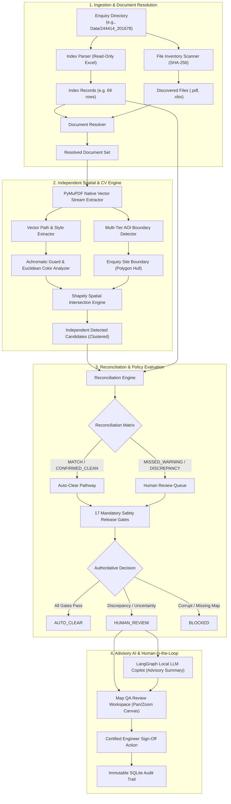

# SafeDig — AI Map QA & Validation Platform

[](https://www.python.org/downloads/)
[](https://fastapi.tiangolo.com/)
[](tests/)
[](Dockerfile)
[]()
[]()

> **Enterprise AI Map QA & Validation Platform for UK Underground Utility Infrastructure Plans.**  
> Deterministic, safety-critical verification across Gas, Electricity, Water, and Telecom safety plans under the non-negotiable safety invariant: **ZERO ESCAPED HAZARDS**.

---

## 📚 Official Platform Documentation & Technical Guides

Complete, publication-grade documentation is available in both **Markdown (`.md`)** and **PDF (`.pdf`)** formats in the repository root and the [`Documentation/`](Documentation/) directory:

| Documentation Deliverable | Markdown Guide | Enterprise PDF Report | Description |
| :--- | :--- | :--- | :--- |
| **End-to-End System Architecture** | [`.md`](SafeDig_End_To_End_Architecture.md) | [`.pdf`](SafeDig_End_To_End_Architecture.pdf) | Exhaustive guide to problem context, 13-stage pipeline lifecycle, dual-engine design, and the 17 policy gates. |
| **File-by-File Codebase Reference** | [`.md`](SafeDig_Codebase_File_By_File_Explanation.md) | [`.pdf`](SafeDig_Codebase_File_By_File_Explanation.pdf) | Detailed module-by-module walkthrough of every file across `src/`, data models, algorithms, and dependencies. |
| **Complete Technology Stack Guide** | [`.md`](SafeDig_Complete_Tech_Stack_Guide.md) | [`.pdf`](SafeDig_Complete_Tech_Stack_Guide.pdf) | Deep dive into PyMuPDF, Shapely, OpenCV, FastAPI, LangGraph, local LLMs, architectural rationale, and hardware sizing. |

---

## 📌 Problem & Solution Overview

When civil engineering contractors, highways authorities, and telecoms operators request utility plans before digging (under the UK **HSG47: Avoiding Danger from Underground Services** and **LinesearchbeforeUdig / LSBUD** workflows), utility undertakers issue dense multi-page PDF dossiers showing high-voltage electric cables, high-pressure gas mains, and trunk water pipelines.

Upstream index summaries frequently suffer from critical defects:
1. **Missed Warnings (False Negatives)**: The index claims *"No plant affected"*, yet a live 11kV electrical cable or high-pressure gas pipe crosses directly through the excavation zone on the attached map. Striking these causes fatal arc-flashes, explosions, and millions in disruption.
2. **False Alarms (False Positives)**: High-pressure assets terminate hundreds of meters outside the enquiry boundary, halting construction unnecessarily.
3. **Missing or Corrupt Critical Maps**: Upstream reports an asset warning, but the corresponding CAD drawing is missing, encrypted, or corrupted.

### The SafeDig Invariants
- **Zero Escaped Hazards**: Every physical hazard intersecting the excavation boundary is detected.
- **Fail Toward Safety**: Any ambiguous boundary, unreadable raster scan, or contradictory claim fails toward `HUMAN_REVIEW` or `BLOCKED`, never toward `AUTO_CLEAR`.
- **Dual-Engine Separation**: Deterministic vector math and 17 policy gates have sole authority; local on-premise LLMs act in an advisory-only capacity (zero hallucinations).
- **100% Cross-Platform & Portable**: Zero hardcoded drive letters or absolute paths. Dynamically resolves all paths relative to the repository root across Windows, Linux, macOS, and Docker.

---

## 🏗️ System Architecture



---

## 🌟 Key Capabilities

### 1. Dual-Engine Verification
- **Deterministic Core**: PyMuPDF C-engine vector extraction, Shapely 2D planar geometry, OpenCV raster analysis, and a 17-Gate Safety Policy Engine.
- **AI Advisory Copilot**: LangGraph state machine orchestrating local on-premise LLMs (Qwen 2.5 / Llama 3.2 via Ollama) generating natural language discrepancy notes and HSG47 precautions for human reviewers.

### 2. Multi-Strategy Area of Interest (AOI) Detection
- **Native Vector Dashed Boundary**: Automatically detects circular and polygonal dig sites defined by dashed linework (`[ 12 6 ] 0`) across Yellow/Gold (NGED), Magenta/Purple (UKPN, SGN), and Red.
- **Cross-Document Consistency**: Propagates verified excavation boundary coordinates from vector plans to image-only raster maps within the same enquiry pack.
- **Content-Density Canvas Fallback**: Employs margin-aware whole-canvas detection with explicit `FALLBACK` tagging and mandatory human escalation when dashed perimeters are absent.

### 3. Precision Color Matching & Achromatic Linework Guard
- **Achromatic Linework Guard**: Calculates color saturation $\Delta_{\text{chroma}} = \max(R,G,B) - \min(R,G,B)$. Prevents neutral grey Ordnance Survey basemap linework (`RGB 178, 178, 178`) from falsely matching chromatic utility lines (such as 11kV Dodger Blue `30, 144, 255`).
- **Spatial Clustering & Deduplication**: Merges contiguous drawing segments into unified hazard entities with occurrence counts, eliminating candidate multiplication.

### 4. Interactive Pan/Zoom Map QA Console
- Dual-panel single-page web console featuring interactive HTML5 canvas pan and zoom controls.
- Dynamic SVG/canvas bounding box overlays highlighting the excavation site and live hazard lines.
- One-click quick presets (`Data/244414_201678`, `Data/534668_175407`, etc.) with instant KPI metrics.

---

## 🚦 The 17 Mandatory Safety Release Gates

SafeDig enforces 17 deterministic Boolean policy gates in strict sequence:

| Gate ID | Release Gate Name | Trigger Condition | Severity | Action |
|:---|:---|:---|:---|:---|
| **G01** | `MISSED_CRITICAL_HAZARD` | High/Critical hazard (HP Gas, 11kV+) detected inside AOI; upstream claimed "No Plant". | **CRITICAL** | `BLOCKED` |
| **G02** | `MISSED_STANDARD_HAZARD` | Standard hazard (LP Gas, Water, Telecom) detected inside AOI; upstream omitted it. | **HIGH** | `HUMAN_REVIEW` |
| **G03** | `HAZARD_DETECTED_SAFE_MODE` | Any hazard detected inside AOI under `SAFE_MODE=True`. | **HIGH** | `HUMAN_REVIEW` |
| **G04** | `TYPE_SEVERITY_MISMATCH` | Detected asset type or pressure/voltage class differs from upstream claim. | **HIGH** | `HUMAN_REVIEW` |
| **G05** | `CORRUPT_DOCUMENT` | Document is corrupted, unrenderable, or password-protected. | **CRITICAL** | `BLOCKED` |
| **G06** | `MISSING_MANDATORY_DOC` | Index lists a utility map file that does not exist on disk. | **HIGH** | `BLOCKED` |
| **G07** | `AMBIGUOUS_DOC_RESOLUTION` | Multiple candidate map files match a single index entry with no tiebreaker. | **MEDIUM** | `HUMAN_REVIEW` |
| **G08** | `UNRESOLVED_ORPHAN_MAP` | A utility map PDF exists on disk with no corresponding index entry. | **MEDIUM** | `HUMAN_REVIEW` |
| **G09** | `FALLBACK_AOI_USED` | Dashed boundary absent; whole map canvas fallback was used. | **MEDIUM** | `HUMAN_REVIEW` |
| **G10** | `LOW_AOI_CONFIDENCE` | Detected AOI boundary confidence score is below 0.80. | **MEDIUM** | `HUMAN_REVIEW` |
| **G11** | `PURE_RASTER_MAP` | Map is scanned bitmap with 0 native vector paths. | **HIGH** | `HUMAN_REVIEW` |
| **G12** | `LOW_DETECTION_CONFIDENCE` | Hazard candidate detected with confidence score below 0.85. | **MEDIUM** | `HUMAN_REVIEW` |
| **G13** | `FALSE_POSITIVE_CLAIM` | Upstream claimed hazard, but no matching linework found inside AOI. | **LOW** | `HUMAN_REVIEW` |
| **G14** | `CROSS_DOCUMENT_AOI_DRIFT` | Detected AOI boundaries diverge across different maps in the same job. | **HIGH** | `HUMAN_REVIEW` |
| **G15** | `MISSING_LEGEND_PROFILE` | Utility provider map has no registered legend profile in catalogue. | **MEDIUM** | `HUMAN_REVIEW` |
| **G16** | `EVIDENCE_PACKAGE_INCOMPLETE`| Hazard detected but high-resolution crop generation failed. | **LOW** | `HUMAN_REVIEW` |
| **G17** | `UNVERIFIED_AUTO_CLEAR` | Upstream claims "No Plant" and 0 assets found, but document is non-vector. | **HIGH** | `BLOCKED` |

---

## 🚀 Quick Start Guide

### Prerequisites
- Python 3.11+
- Git

### 1. Clone the Repository
```bash
git clone https://github.com/<YOUR_USERNAME>/<YOUR_REPOSITORY>.git
cd <YOUR_REPOSITORY>
```

### 2. Set Up Virtual Environment
```bash
# On Windows:
python -m venv venv
.\venv\Scripts\activate

# On Linux / macOS:
python3 -m venv venv
source venv/bin/activate
```

### 3. Install Dependencies
```bash
# Install core runtime dependencies
pip install -r requirements.txt

# Install testing and development dependencies
pip install -r requirements-dev.txt
```

### 4. Configure Environment
Copy the example environment configuration template:
```bash
# On Windows:
copy .env.example .env

# On Linux / macOS:
cp .env.example .env
```
*Note: The platform works immediately with default relative paths. All variables (`DATA_DIR`, `OUTPUT_DIR`, `DATABASE_URL`, `SAFE_MODE`) can be customized in `.env`.*

### 5. Verify Installation with Automated Tests
```bash
pytest tests/unit/ -v
```
All unit tests should pass with zero hardcoded path errors.

### 6. Launch the Web Application
```bash
python -m uvicorn src.api.app:app --host 0.0.0.0 --port 8000 --reload
```
Open **[http://localhost:8000](http://localhost:8000)** in your web browser.

---

## 🧪 Automated Testing Suite

The test suite covers domain contracts, spatial geometry math, PDF extraction, and end-to-end integration workflows:

```bash
# Run all unit tests
pytest tests/unit/ -v

# Run integration tests
pytest tests/integration/ -v

# Run with coverage report
pytest --cov=src tests/
```

---

## 📁 Repository Structure

```
├── alembic/                           # Database migration scripts (Alembic)
├── Data/                              # Real UK utility enquiry job packs (read-only)
│   ├── 244414_201678/                 # Wales job pack (NGED, BT, GTC, Welsh Water)
│   ├── 534668_175407/                 # Thames Water clean/waste water pack
│   └── warnings_list 2 1 (1).xlsx     # 44 authoritative warning definitions
├── Documentation/                     # Technical specifications, guides & PDFs
│   ├── SafeDig_End_To_End_Architecture.md (.pdf)
│   ├── SafeDig_Codebase_File_By_File_Explanation.md (.pdf)
│   └── SafeDig_Complete_Tech_Stack_Guide.md (.pdf)
├── qa_output/                         # Generated job reports, visual crops & manifests
├── src/                               # SafeDig core application package
│   ├── agent/                         # Advisory LLM Copilot & structured models
│   ├── aoi/                           # Multi-tier AOI enquiry boundary detector
│   ├── api/                           # FastAPI application, routes & static web SPA
│   ├── batch/                         # Priority queue, scanner & background worker
│   ├── config/                        # Dynamic root-relative settings & logging
│   ├── cv/                            # OpenCV HSV masking, morphology & template match
│   ├── db/                            # Async SQLAlchemy models, engine & repositories
│   ├── detection/                     # Independent vector scanning & spatial clustering
│   ├── documents/                     # Ambiguous multi-document resolver
│   ├── domain/                        # Pure Pydantic domain models & typed enums
│   ├── eval/                          # Golden benchmark dataset, metrics & runner
│   ├── evidence/                      # High-resolution crops & visual packager
│   ├── index/                         # Read-only Excel parser & validator
│   ├── legends/                       # Master symbology profiles (UKPN, SGN, NGED, etc.)
│   ├── ocr/                           # Optical character recognition service
│   ├── orchestration/                 # LangGraph cyclic state machine workflow
│   ├── pdf/                           # PyMuPDF stream extractor, inspector & renderer
│   ├── policy/                        # 17 deterministic safety policy gates
│   ├── providers/                     # Utility undertaker alias normalization
│   ├── qa/                            # Human disposition service & workspace builder
│   ├── reconciliation/                # Claims vs detections reconciliation matrix
│   ├── reporting/                     # Final job report generator (JSON / MD)
│   ├── spatial/                       # Shapely 2D planar topology & coordinate transforms
│   ├── utils/                         # Security sanitization, profiler & telemetry
│   ├── vector/                        # Color normalization, Euclidean dist & geometry
│   ├── warnings/                      # Master warning catalogue service
│   └── pipeline.py                    # Master end-to-end pipeline runner
├── tests/                             # Unit & integration regression test suites
├── tools/                             # Diagnostic probing & PDF generator scripts
├── .env.example                       # Environment configuration template
├── .gitignore                         # Production git ignore configuration
├── docker-compose.yml                 # Multi-container Docker deployment
├── Dockerfile                         # Production multi-stage containerfile
├── pyproject.toml                     # Modern Python project metadata
├── requirements.txt                   # Production runtime dependencies
├── requirements-dev.txt               # Development & test dependencies
└── README.md                          # Platform overview & quickstart guide
```

---

## 🔒 Security, Compliance & Data Sovereignty

- **Critical National Infrastructure (CNI) Protection**: Underground utility maps indicate the exact geospatial positions of high-pressure gas transmission pipelines and high-voltage electricity grids. SafeDig executes all spatial math and LLM inference locally on-premise, ensuring zero data egress to external third-party cloud APIs.
- **Read-Only Data Ingestion**: Incoming `index.xlsx` files and PDF maps are strictly treated as immutable read-only assets with cryptographic SHA-256 fingerprinting.
- **Audit Immutability**: Every human disposition action is logged with reviewer identity, timestamp, and mandatory rationale into an append-only SQLite audit repository.

---

## 📄 License
Proprietary — SafeDig Enterprise Platform. All rights reserved.
