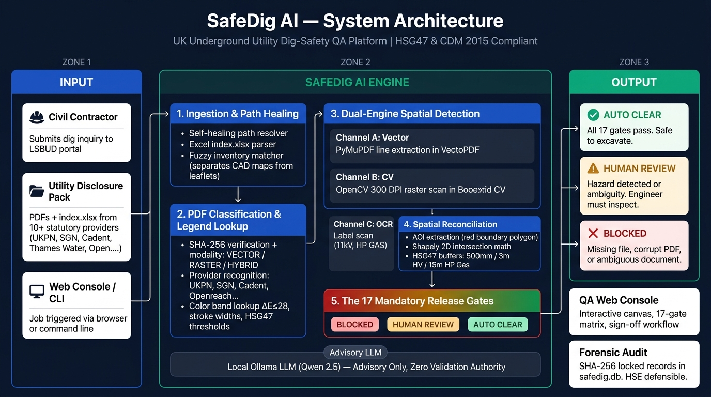

<div align="center">

# 🛡️ SafeDig AI
### UK Underground Utility Dig-Safety Map QA & Validation Platform

[](https://www.python.org/)
[](https://fastapi.tiangolo.com/)
[](https://github.com/langchain-ai/langgraph)
[](https://pymupdf.readthedocs.io/)
[](https://opencv.org/)
[](https://www.hse.gov.uk/)
[](/)

> **Safety Invariant → `SAFE_MODE = True` → ZERO ESCAPED HAZARDS**

*Automated AI-augmented safety validator that re-validates upstream utility warning claims against actual CAD engineering drawings using deterministic computer vision, spatial mathematics, and 17 mandatory release gates — preventing fatal excavation strikes on buried high-voltage cables and high-pressure gas mains.*

</div>

---

## 🏗️ System Architecture



> **How it works in plain English:**  
> A civil contractor submits a dig inquiry. Utility companies reply with PDF maps + an Excel index. SafeDig ingests everything, independently scans every CAD drawing with dual-engine computer vision, computes whether any underground hazard intersects the excavation boundary, and runs 17 deterministic safety gates. The result is either a verified **AUTO CLEAR**, an escalated **HUMAN REVIEW**, or a hard **BLOCK** — with a tamper-proof SHA-256 audit record.

---

## ⚡ The Problem SafeDig Solves

In the UK, civil excavators must submit "dial-before-you-dig" inquiries via [LSBUD](https://lsbud.co.uk/) before breaking ground. Asset owners (UKPN, SGN, Cadent, Thames Water, Openreach etc.) return disclosure bundles containing summary letters and CAD drawings.

**The fatal failure mode:** A cover letter says *"No assets affected in your enquiry boundary"* — but the attached CAD plan clearly shows a live **11,000 Volt cable** slicing through the proposed trench. The site foreman trusts the letter, digs with a mechanical excavator, and strikes it.

| Failure Mode | Real Consequence | SafeDig Defence |
| :--- | :--- | :--- |
| **Missed Warning (False Negative)** | Arc-flash fatality, gas explosion, grid blackout | `MISSED_WARNING` → mandatory `HUMAN_REVIEW` |
| **Ambiguous multi-map pack** | Engineer picks the wrong authoritative drawing | `AMBIGUOUS` resolution → `BLOCKED` |
| **Corrupt / missing PDF** | Site digs on paperwork alone | `CORRUPTED` document → `BLOCKED` |
| **Upstream omission** | Provider forgot to declare HP gas line | Independent CV scan catches it regardless |

> **The Invariant:** *"Every ambiguous, degraded, contradictory, or unreadable document must fail toward `HUMAN_REVIEW` or `BLOCKED` — never toward `AUTO_CLEAR`. A false negative is never traded for a cleaner false-positive count."*

---

## 🚀 Quick Start

### Prerequisites
- **Python 3.11+**  
- **Git**
- *(Optional)* [Ollama](https://ollama.ai/) for local LLM advisory summaries (`qwen2.5:7b`)

### 1. Clone & Setup

```bash
git clone https://github.com/<YOUR_USERNAME>/safedig.git
cd safedig

# Create virtual environment
python -m venv venv

# Activate (Windows)
.\venv\Scripts\activate

# Activate (Linux / macOS)
source venv/bin/activate
```

### 2. Install Dependencies

```bash
pip install -r requirements.txt
pip install -r requirements-dev.txt
```

### 3. Configure Environment

```bash
# Windows
copy .env.example .env

# Linux / macOS
cp .env.example .env
```

Key settings in `.env`:

```ini
SAFE_MODE=True                           # Never disable in production
DATABASE_URL=sqlite:///safedig.db
OLLAMA_BASE_URL=http://localhost:11434   # Optional — has 0ms fallback
OLLAMA_MODEL=qwen2.5:7b
LOG_LEVEL=INFO
```

### 4. Launch the Web Console

```bash
python -m uvicorn src.api.app:app --host 127.0.0.1 --port 8000 --reload
```

Open **[http://127.0.0.1:8000](http://127.0.0.1:8000)** — interactive radar scanner, canvas pan/zoom, and 17-gate status dashboard.

### 5. Run the Pipeline via CLI

```bash
# Auto-detect the first available job in Data/
python run_e2e_test.py

# Or target a specific job folder
python run_e2e_test.py Data/482319_212094
```

---

## 🔬 How the Engine Works (11 Phases)

```
Phase 1  →  INTAKE           Self-healing path resolution + index.xlsx parsing
Phase 2  →  INGESTION        SHA-256 verification + PDF modality (VECTOR/RASTER/HYBRID)
Phase 3  →  LEGEND LOOKUP    Provider recognition → colour bands (ΔE≤28) + HSG47 thresholds
Phase 4  →  AOI DETECTION    Extract excavation boundary polygon + rotation normalisation
Phase 5  →  VECTOR SCAN      PyMuPDF path extraction (Channel A)
Phase 6  →  RASTER SCAN      OpenCV 300 DPI HSV masking + contour detection (Channel B)
Phase 7  →  OCR BOOST        Text scan for "11kV", "HP GAS", "SUBSTATION" labels (Channel C)
Phase 8  →  RECONCILIATION   Shapely 2D intersection + HSG47 buffers (500mm/3m/15m)
Phase 9  →  17 GATES         Deterministic Boolean policy evaluation
Phase 10 →  ADVISORY LLM     Ollama Qwen 2.5 summary (advisory only, zero authority)
Phase 11 →  AUDIT LOCK       SHA-256 forensic record committed to safedig.db
```

---

## 🚦 The 17 Mandatory Release Gates

A document only receives `AUTO_CLEAR` when **all 17 gates simultaneously pass**. A single failure halts clearance.

| Stage | Gates | Responsibility |
| :--- | :--- | :--- |
| **Stage 1** — Intake & Pre-Flight | `01` → `04` | Index validity, PDF existence, 1-to-1 document resolution, readability |
| **Stage 2** — Provider & Knowledge | `05` → `07` | Statutory undertaker ID, warning catalogue, cartographic legend |
| **Stage 3** — Spatial AOI | `08` → `09` | Excavation polygon extraction, topological closure, vertex count |
| **Stage 4** — Detection & Reconciliation | `10` → `13` | Dual-engine scan completion, intersection math, zero missed hazards, detector consensus |
| **Stage 5** — QA, Evidence & Audit | `14` → `17` | Image quality, provider rules, evidence package completeness, audit persistence |

### Decision Ladder (Priority Order)

```
Upstream "No" + CV confirms clean       →  🟢  AUTO_CLEAR
Document missing or corrupted           →  🔴  BLOCKED
Multiple candidate maps (ambiguous)     →  🔴  BLOCKED
Plan is an enquiry notice, no map data  →  🔴  BLOCKED
MISSED_WARNING detected                 →  🟡  HUMAN_REVIEW  (mandatory)
POSSIBLE_FALSE_POSITIVE                 →  🟡  HUMAN_REVIEW
Critical hazard confirmed in AOI        →  🟡  HUMAN_REVIEW
Legend or AOI unresolvable              →  🟡  HUMAN_REVIEW
All 17 gates pass + evidence complete   →  🟢  AUTO_CLEAR
```

---

## 🧠 Dual-Engine Design Principle

SafeDig uses a **strict separation of authority**:

```
┌─────────────────────────────────────────────────────────┐
│  DETERMINISTIC CORE  (100% authority over all decisions) │
│  PyMuPDF + Shapely + OpenCV + 17 Policy Gates           │
│  Bit-for-bit reproducible. Zero hallucination.          │
└─────────────────────────────────────────────────────────┘
               ↕  advisory only, zero authority
┌─────────────────────────────────────────────────────────┐
│  ADVISORY AI LAYER  (generates human-readable summaries) │
│  LangGraph + Ollama (Qwen 2.5 / Llama 3.2)             │
│  Cannot override, clear, or relax any safety gate.      │
│  If offline → 0ms deterministic rule fallback.          │
└─────────────────────────────────────────────────────────┘
```

---

## 📁 Project Structure

```
SafeDig_AG/
│
├── 📂 src/                          # Core application (28 packages, 85+ files)
│   ├── agent/                       # Advisory LLM service & models
│   ├── aoi/                         # Excavation boundary detector
│   ├── api/                         # FastAPI server, routes & web console
│   │   └── static/                  # HTML5 + JavaScript single-page UI
│   ├── batch/                       # Background queue, scanner & workers
│   ├── config/                      # Pydantic settings & structured logging
│   ├── cv/                          # OpenCV HSV masking & morphology
│   ├── db/                          # SQLite engine, ORM models & repositories
│   ├── detection/                   # Dual-engine spatial detection coordinator
│   ├── domain/                      # Pydantic domain models & enums
│   ├── eval/                        # Benchmark datasets & accuracy metrics
│   ├── evidence/                    # 300 DPI crop generator & overlays
│   ├── index/                       # Excel index.xlsx parser & validator
│   ├── ingestion/                   # Fuzzy inventory matcher & hasher
│   ├── legends/                     # Cartographic legend registry
│   ├── ocr/                         # OCR hazard label scanner
│   ├── orchestration/               # LangGraph DAG & pipeline nodes
│   ├── pdf/                         # PyMuPDF extractor, inspector & renderer
│   ├── policy/                      # ← The 17 Mandatory Release Gates
│   ├── providers/                   # Statutory undertaker name registry
│   ├── qa/                          # QA workspace & human review disposition
│   ├── reconciliation/              # Shapely 2D intersection engine
│   ├── reporting/                   # Job report generator (JSON / MD)
│   ├── spatial/                     # Coordinate transforms & HSG47 buffers
│   ├── utils/                       # Path resolver, security & telemetry
│   ├── vector/                      # PDF vector path analyser & geometry
│   ├── warnings/                    # HSG47 warning catalogue & thresholds
│   └── pipeline.py                  # CLI pipeline entry point
│
├── 📂 Data/                         # Statutory utility enquiry job folders
├── 📂 Documentation/                # All specs: Markdown + PDF
│   ├── SafeDig_System_Architecture_Diagram.jpg
│   ├── SafeDig_17_Mandatory_Release_Gates.md/pdf
│   ├── SafeDig_Codebase_File_by_File_Explanation.md/pdf
│   ├── SafeDig_Complete_End_to_End_Execution_and_Code_Working_Mechanism.md/pdf
│   ├── SafeDig_End_to_End_Project_Architecture.md/pdf
│   ├── SafeDig_Technology_Stack_Specification.md/pdf
│   └── SafeDig_Trainee_Onboarding_and_Engineering_Cookbook.md/pdf
├── 📂 alembic/                      # Database schema migrations
├── 📂 evidence/                     # Runtime legend crop outputs
├── 📂 info/                         # Domain specs & requirements traceability
├── 📂 qa_output/                    # Pipeline output: evidence, reports
├── 📂 tests/                        # PyTest unit & integration suites
├── 📂 tools/                        # Documentation generators & utilities
│
├── .env / .env.example              # Environment configuration
├── alembic.ini                      # DB migration config
├── pyproject.toml                   # Project metadata & pytest config
├── requirements.txt                 # Production dependencies
├── requirements-dev.txt             # Dev & test dependencies
├── run_e2e_test.py                  # End-to-end pipeline test runner
├── run_production.bat               # Windows production launch
└── safedig.db                       # Live SQLite forensic audit database
```

---

## 🧪 Testing

```bash
# Unit tests (pure logic, no real data required)
pytest tests/unit/ -v

# Integration tests (requires Data/ job folders)
pytest tests/integration/ -v

# Full suite with coverage
pytest --cov=src tests/

# End-to-end pipeline test (auto-detects Data/ folder)
python run_e2e_test.py
```

---

## 📚 Documentation

All documentation lives in [`Documentation/`](Documentation/) as both **Markdown** and **PDF**:

| Document | Description |
| :--- | :--- |
| [System Architecture](Documentation/SafeDig_End_to_End_Project_Architecture.md) | 7-tier architecture blueprint, dataflow, deployment topology |
| [End-to-End Code Working Mechanism](Documentation/SafeDig_Complete_End_to_End_Execution_and_Code_Working_Mechanism.md) | Deep-dive into all 11 execution phases with code references |
| [17 Mandatory Release Gates](Documentation/SafeDig_17_Mandatory_Release_Gates.md) | Gate-by-gate specification with Python code, HSG47 rationale & triage |
| [Codebase File-by-File Guide](Documentation/SafeDig_Codebase_File_by_File_Explanation.md) | Every file across all 28 packages explained |
| [Technology Stack Specification](Documentation/SafeDig_Technology_Stack_Specification.md) | Full bill of materials, hardware profiles, deployment specs |
| [Trainee Onboarding & Cookbook](Documentation/SafeDig_Trainee_Onboarding_and_Engineering_Cookbook.md) | Day-1 setup, mental models, recipes for adding providers & gates |

To regenerate all documentation:
```bash
python tools/sync_all_documentation.py
```

---

## 🛡️ Technology Stack

| Layer | Technology | Version | Role |
| :--- | :--- | :--- | :--- |
| Language | Python | `3.11+` | Core runtime |
| REST API | FastAPI + Uvicorn | `0.100+` | Async API server |
| Vector Engine | PyMuPDF | `1.28.2` | PDF path extraction & 300 DPI render |
| Spatial Math | Shapely + GEOS | `2.0+` | 2D polygon intersection |
| Computer Vision | OpenCV Headless | `4.8+` | HSV masking, contour detection |
| Orchestration | LangGraph | `0.2+` | Stateful pipeline DAG |
| Local LLM | Ollama (Qwen 2.5) | `7B / 14B` | Advisory summaries only |
| Database | SQLite + SQLAlchemy | `2.0+` | Forensic audit (WAL mode) |
| Migrations | Alembic | `1.13+` | Schema versioning |
| Data Parsing | Pandas + OpenPyXL | `2.0+` | index.xlsx ingestion |
| PDF Reports | ReportLab | `5.0.1` | Compliance spec generation |

---

## 🔒 Security & Compliance

- **Zero Cloud Egress** — All LLM inference runs locally via Ollama. Utility maps (Critical National Infrastructure data) never leave the premises.
- **Read-Only Ingestion** — `index.xlsx` and all PDFs are treated as immutable with SHA-256 fingerprinting.
- **Immutable Audit Trail** — Every decision, gate evaluation, and human override is permanently recorded in `safedig.db` with timestamps and cryptographic signatures.
- **HSG47 & CDM 2015 Compliant** — Standoff buffers (500mm hand-dig / 3m HV / 15m HP Gas), mandatory human review for all critical hazards, and full forensic reproducibility for HSE statutory inquiries.

---

## 📄 License

**Proprietary** — SafeDig Enterprise Platform. All rights reserved.

---

<div align="center">

*Built for UK civil engineering safety. Every line of code serves one purpose: making sure no excavator ever strikes an undisclosed buried hazard.*

</div>
